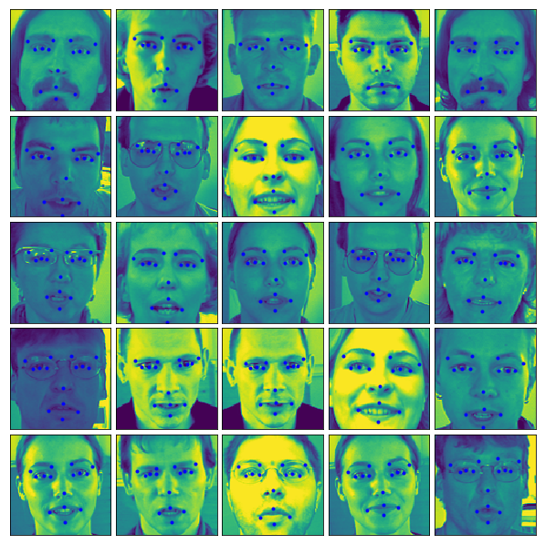

# Machine Learning Engineer Nanodegree

## Capstone Project: Facial Keypoints Detection
Daniel Vargas  
October 21, 2019


## I. Definition

### Project Overview

**Facial Keypoints `(facial landmarks)` detection** is an important and challenging problem in the field of **computer vision**, which involves detecting facial keypoints like centers and corners of `eyes`, `nose`, and `mouth`, etc. The problem is to predict the `(x, y)` real-valued coordinates in the space of image pixels of the facial keypoints for a given face image. 

Facial features vary greatly from one individual to another, and even for a single individual there is a large amount of variation due to `pose`, `size`, `position`, etc. The problem becomes even more challenging when the face images are taken under different `illumination conditions`, `viewing angles`, etc.

Solving this problem that can provide the building blocks for several applications, such as:

- tracking faces in images and video
- analysing facial expressions
- detecting dysmorphic facial signs for medical diagnosis
- biometrics / face recognition

In the past few years, advancements in facial keypoints detection have been made by implementing **`Deep Convolutional Neural Networks (DCNN)**`.

Relevant academic research on this domain can be found in

- [Facial Keypoints Detection](https://pdfs.semanticscholar.org/f9a3/072ee0a579475f5b5359e782ea32c2cbf24c.pdf)
- [Facial Key Points Detection using Deep Convolutional Neural Network - NaimishNet](https://arxiv.org/pdf/1710.00977.pdf).

I chose this specific challenge because I currently work in the medical diagnosis field. I expect this project to help me understand facial keypoints recognition in a deeper way.

### Datasets and Inputs

The data was acquired from the [Facial Keypoints Detection](https://www.kaggle.com/c/facial-keypoints-detection/overview) `Kaggle` competition. 

### Data files

- [`training.csv`](https://www.kaggle.com/c/facial-keypoints-detection/download/training.zip): list of `7049 training images`. Each row contains the (x, y) coordinates for 15 keypoints, and image data as row-ordered list of pixels.
- [`test.csv`](https://www.kaggle.com/c/facial-keypoints-detection/download/test.zip): list of `1783 test images`. Each row contains ImageId and image data as row-ordered list of pixels

### Problem Statement

The objective of this project is to accurately predict the facial keypoints (facial landmarks) of a face image. My hypothesis is, that this prediction can be performed based on a training set containing accurate facial keypoints, through a regression approach.

A `Convolutional Neural Network` (`CNN`) will be applied to predict the facial keypoints. A `CNN` was chosen for this problem because:

- This is a computer vision problem that requires capturing features for prediction
- CNNs are very useful in capturing features in images
- The expected responses (coordinates) make this a regression problem

_A simple `Multilayer Perceptron (MLP)` will be used as a baseline model for comparison._

### Metrics

The metric used to measure performance of the model i `Root Mean Squared Error` (`RMSE`):


`RMSE` is very common and is a suitable general-purpose error metric in regression problems. Compared to the `Mean Absolute Error`, `RMSE` punishes large errors.

### Network Strategy

- Data augmentaion will be included if results are not satisfactory
- The network's artitecture is as follows:
    - Input layer
    - Convolution layers
    - Max Pooling layers
    - Batch Normalization layers
    - Fully Connected layers
    - Dropout layers
    - Prediction layer


## II. Analysis

### Data Exploration

Each predicted keypoint is specified by an (x,y) real-valued pair in the space of pixel indices. There are 15 keypoints, which represent the following elements of the face:

|               |               |               |
| ------------- | ------------- | ------------- |
| `left_eye_center`  | `right_eye_center`  | `right_eye_center`  |
| `left_eye_inner_corner`  | `left_eye_outer_corner`  | `right_eye_inner_corner`  |
| `left_eyebrow_inner_end`  | `left_eyebrow_outer_end`  | `right_eyebrow_inner_end`  |
| `right_eyebrow_outer_end`  | `nose_tip`  | `mouth_left_corner`  |
| `mouth_right_corner`  | `mouth_center_top_lip`  | `mouth_center_bottom_lip`  |

- _Left and right here refers to the point of view of the subject_
- _In some examples, some of the target keypoint positions are misssing (encoded as missing entries in the csv, i.e., with nothing between two commas)_
- _The input image is given in the last field of the data files, and consists of a list of pixels (ordered by row), as integers in (0,255). The images are 96x96 pixels_

### Exploratory Visualization

The data is summarized as follows.

```python
Data columns (total 31 columns):

left_eye_center_x            7039 non-null float64
left_eye_center_y            7039 non-null float64
right_eye_center_x           7036 non-null float64
right_eye_center_y           7036 non-null float64
left_eye_inner_corner_x      2271 non-null float64
left_eye_inner_corner_y      2271 non-null float64
left_eye_outer_corner_x      2267 non-null float64
left_eye_outer_corner_y      2267 non-null float64
right_eye_inner_corner_x     2268 non-null float64
right_eye_inner_corner_y     2268 non-null float64
right_eye_outer_corner_x     2268 non-null float64
right_eye_outer_corner_y     2268 non-null float64
left_eyebrow_inner_end_x     2270 non-null float64
left_eyebrow_inner_end_y     2270 non-null float64
left_eyebrow_outer_end_x     2225 non-null float64
left_eyebrow_outer_end_y     2225 non-null float64
right_eyebrow_inner_end_x    2270 non-null float64
right_eyebrow_inner_end_y    2270 non-null float64
right_eyebrow_outer_end_x    2236 non-null float64
right_eyebrow_outer_end_y    2236 non-null float64
nose_tip_x                   7049 non-null float64
nose_tip_y                   7049 non-null float64
mouth_left_corner_x          2269 non-null float64
mouth_left_corner_y          2269 non-null float64
mouth_right_corner_x         2270 non-null float64
mouth_right_corner_y         2270 non-null float64
mouth_center_top_lip_x       2275 non-null float64
mouth_center_top_lip_y       2275 non-null float64
mouth_center_bottom_lip_x    7016 non-null float64
mouth_center_bottom_lip_y    7016 non-null float64
Image                        7049 non-null object

dtypes: float64(30), object(1)
```

Also, below is an example group of images.



### Algorithms and Techniques

For this problem, I will use a **`Convolutional Neural Network (CNN)`**: In this, will use a Sequential (there's only a single input) model With 3 different Conv2D layers each having a max pooling layer having a pool size and stride of 2*2. Each layer I have also added batch normalization and dropouts to avoid overfitting. At the end, I have also added 3 fully connected layers With dropouts. In this, have used adam optimizer having epochs set to 200 and a batch size of 128. 

This is the model's summary:

```python
Layer (type)                 Output Shape              Param #   
=================================================================
conv2d_5 (Conv2D)            (None, 96, 96, 16)        80        
_________________________________________________________________
dropout_7 (Dropout)          (None, 96, 96, 16)        0         
_________________________________________________________________
max_pooling2d_5 (MaxPooling2 (None, 48, 48, 16)        0         
_________________________________________________________________
batch_normalization_5 (Batch (None, 48, 48, 16)        64        
_________________________________________________________________
conv2d_6 (Conv2D)            (None, 44, 44, 32)        12832     
_________________________________________________________________
max_pooling2d_6 (MaxPooling2 (None, 22, 22, 32)        0         
_________________________________________________________________
dropout_8 (Dropout)          (None, 22, 22, 32)        0         
_________________________________________________________________
batch_normalization_6 (Batch (None, 22, 22, 32)        128       
_________________________________________________________________
conv2d_7 (Conv2D)            (None, 18, 18, 64)        51264     
_________________________________________________________________
max_pooling2d_7 (MaxPooling2 (None, 9, 9, 64)          0         
_________________________________________________________________
batch_normalization_7 (Batch (None, 9, 9, 64)          256       
_________________________________________________________________
conv2d_8 (Conv2D)            (None, 7, 7, 128)         73856     
_________________________________________________________________
max_pooling2d_8 (MaxPooling2 (None, 3, 3, 128)         0         
_________________________________________________________________
dropout_9 (Dropout)          (None, 3, 3, 128)         0         
_________________________________________________________________
batch_normalization_8 (Batch (None, 3, 3, 128)         512       
_________________________________________________________________
flatten_2 (Flatten)          (None, 1152)              0         
_________________________________________________________________
dense_7 (Dense)              (None, 500)               576500    
_________________________________________________________________
dropout_10 (Dropout)         (None, 500)               0         
_________________________________________________________________
dense_8 (Dense)              (None, 128)               64128     
_________________________________________________________________
dropout_11 (Dropout)         (None, 128)               0         
_________________________________________________________________
dense_9 (Dense)              (None, 30)                3870      
=================================================================
Total params: 783,490
Trainable params: 783,010
Non-trainable params: 480
```

### Benchmark

The benchmark Multilayer Perceptron `(MLP)`: In this, will use a Sequential model With 3 different layers followed by an activation function "Relu", and will also add a dropout after the first layer. I have used SGD optimizer for this using 50 epochs and a batch size of 128.

This is the model's summary:

```python
Layer (type)                 Output Shape              Param #   
=================================================================
dense_7 (Dense)              (None, 256)               2359552   
_________________________________________________________________
activation_5 (Activation)    (None, 256)               0         
_________________________________________________________________
dropout_3 (Dropout)          (None, 256)               0         
_________________________________________________________________
dense_8 (Dense)              (None, 128)               32896     
_________________________________________________________________
activation_6 (Activation)    (None, 128)               0         
_________________________________________________________________
dense_9 (Dense)              (None, 30)                3870      
=================================================================
Total params: 2,396,318
Trainable params: 2,396,318
Non-trainable params: 0
```

## III. Methodology

### Data Preprocessing

# TODO: complete
# TODO: add only % of data used

### Implementation

The implemented models are `MLP.h5` and `CNN.h5`

### Refinement

# TODO: complete

## IV. Results

### Model Evaluation and Validation

The final model was evaluated with the dataset provided in **Kaggle** and tested by submitting the results to the competition.

### Justification

The final model performs better than the benchmark model on the test set.

## V. Conclusion

### Free-Form Visualization

These two images shows the final models performance in comparison to its base model. 
" best" - The two model results agree the most. 
"worst" - The two model results disagree the most. 

### Reflection

The following steps were taken to complete this process: 
1. 
2. 
3. 
4. 
5. 
Downloaded the dataset from kaggle. 
Scaled the pixel values. 
Used 200/0 of the dataset to train the base models. 
Created special models by dividing the dataset into 6 different groups and trained the base 
models separately on them. 
Converted the files to csv and compared their scores on kaggle. 
As this was the second time apart from dog breed classifier dealt With image classification problem, I 
have learned a lot from this project. The most challenging part was to create the third base model I tried 
using the Keras image flipping inbuilt technique but to flip the keypoints I had to flip them manually. 

### Improvement

# TODO: remove utils
# TODO: add models to repo
# TODO: print models' metrics in notebook and add to .md

There are many ways in which the model can be improved. The trade-offs of these improvements would depend on the final purpose o f the model.

- Perform hyperparameters optimization (e.g. random search, bayes optimization)
- Perform random image augmentation on the training set (e.g. rotations, translations, zoom-in, zoom-out, blur, etc.)
